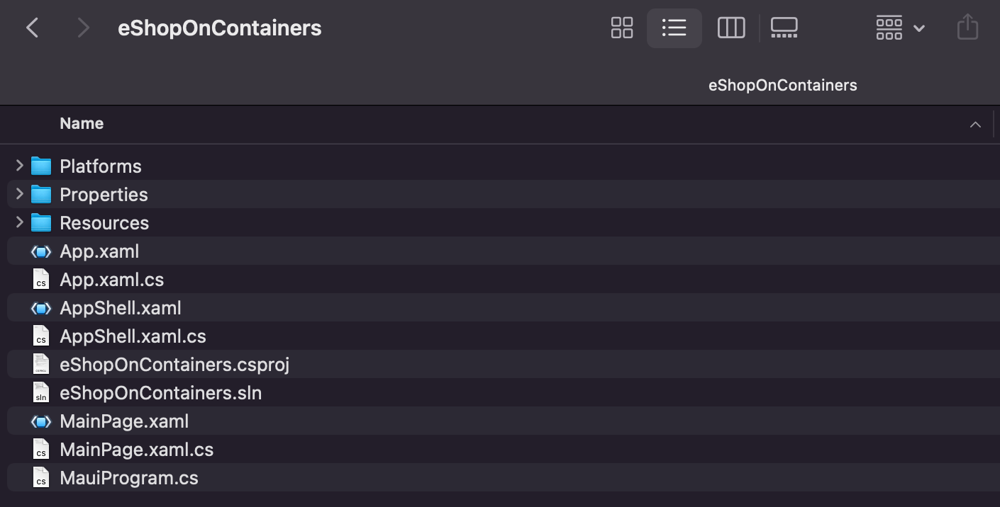

# Migrating eShop From Xamarin.Forms to MAUI

## Create New eShopContainers Solution

### Overview

In order to get our Xamarin.Forms application migrated, we will want to start by creating a new MAUI solution.

> [!Important]
> You will want to make sure that the new solution name matches up to the root namespace of the existing application. This will ensure that we are able to import existing components later on with as little friction as possible.

### macOS

In a terminal, execute the following command to generate a new MAUI program

```dotnetcli
dotnet new maui -n eShopOnContainers
```

### Visual Studio 2022

> [!CAUTION]
> This can be done using the templates in Visual Studio 2022 and needs documentation...

## Navigating the Solution

The new solution will be created and will contain an `eShopOnContainers.sln` file. We will want to open that with Visual Studio 2022 on Windows or Mac.



Our newly generated solution will contain a simple MAUI application. There will be some amount of overlap between what was newly generated an our existing project with the `App.xaml/App.xaml.cs` and `AppShell.xaml/AppShell.xaml.cs` files. We want to make sure that we *do not replace* these files.

MAUI projects have a new structure to them which consolidate all of the platform-specific projects to a singular project. All platform-specific have been moved to the `Platforms` folder. In this folder, it is still possible to write any iOS, Android or Windows code and configurations specifically for those platforms. The `Resources` folder will hold any non-code files needed for the application such as images, fonts, database files, etc.